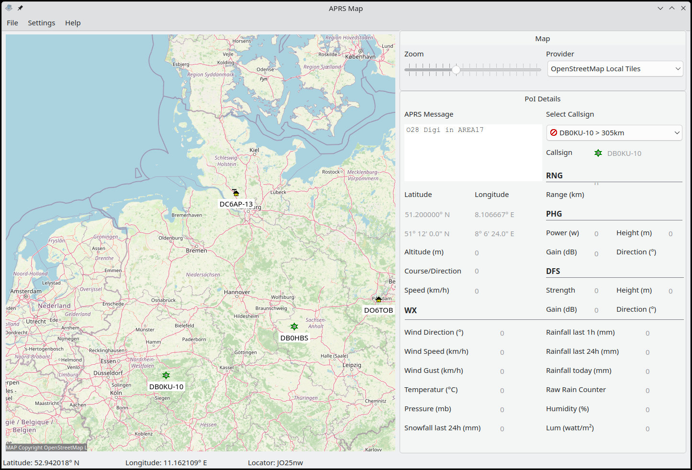

# APRSMap - Cross Platform APRS Client.

## Features

- Receive APRS Messages via Radio through FlexPacket.
- Receive APRS Messages via IGate

## Planned Features

- Offline Map Mode

## How to compile

- Install Lazarus 3.6
- Install TRichMemo, LazMapViewer (it has to be [this version](https://github.com/wp-xyz/LazMapViewer.git))

# Screenshots

