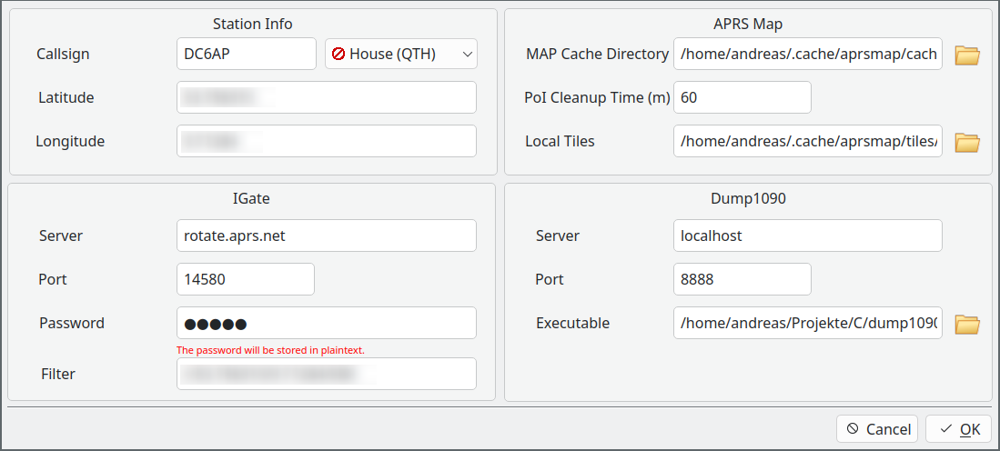

# APRSMap - Cross Platform APRS Client.

[](https://www.paypal.com/donate/?hosted_button_id=ZDB5ZSNJNK9XQ)

## Info

Currently, the Windows autobuild is not working because fossies.org blocks requests originating from GitHub.

## Features

- Receive APRS Messages via Radio through FlexPacket.
- Receive APRS Messages via IGate
- Support for Local (Offline) OSM Tiles
- Receive ADS-B Messages via [dump1090](https://github.com/antirez/dump1090)
- Track all APRS objects
- Filter to show only a specific kind of PoI.
- Window of the last seen APRS objects.
- Show RAW Messages from a APRS object.
- Show Weather and Tracking Chars.
- Support for RS41-SG and DFM Weather probe.
- Support for Mic-E Position Data.
- Support for Compressed Position Data.
- Set own position via GPS.
- Receive User Messages.

## Download

- You will find the current and all last releases for ~~Windows and~~ Linux [here](https://github.com/andreaspeters/aprsmap/releases)
- The newest builds created by the master branch, you will find [here](https://github.com/andreaspeters/aprsmap/actions). Open
  the last successfull build and scroll down to the artifacts.
- The newest APPImage for Linux your will find [here](https://www.hamradiotech.de/assets/download/APRS_Map-x86_64.AppImage).

## Requirements

- [libqt6pas.so/dll](https://github.com/davidbannon/libqt6pas/releases)

## How to compile

- Install Lazarus 3.6
- Install TRichMemo, LazMapViewer (it has to be [this version](https://github.com/wp-xyz/LazMapViewer.git))

## How to use:

### Set IGate Filter

It is possible to configure a IGate filter. To do that, open 'Settings' and 
change the value of Filter. The default one is:

```
r/<LAT>/<LON>/200
```

`r` Stands for the "Range" Filter. `<LAT>` and `<LON>` will be replaced with 
the values of Latitude and Longitude. `200` is the range in km arround
your position.

Take a look into the official [APRS-IS manual](https://www.aprs-is.net/javAPRSFilter.aspx)
to find more examples for filters.


# Screenshots





